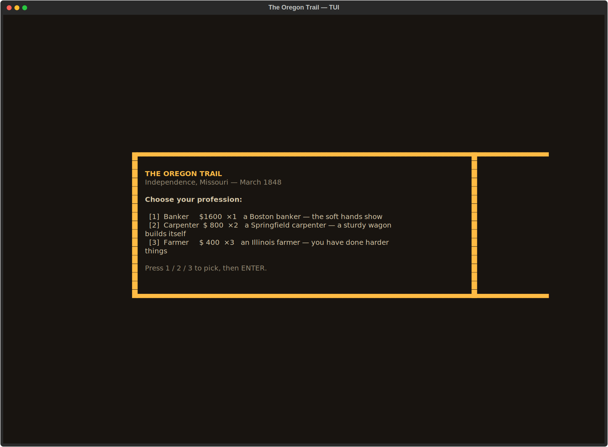
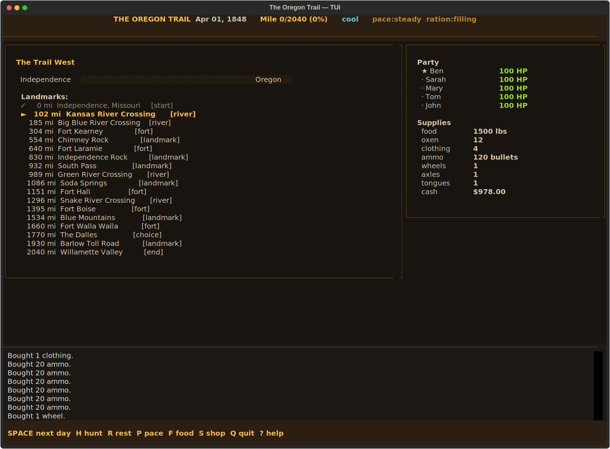

# pioneer-ledger-tui

> Inspired by The Oregon Trail (1971, MECC). Trademarks belong to their respective owners. Unaffiliated fan project.

The trail west starts here.




## About
It is 1848. You have fifteen hundred miles, a wagon, five names on a list, and a box of flour. Ford the Kansas. Pay the ferry at the Platte. Hunt buffalo. Ration meager. Take the Barlow Road or float the Columbia down to The Dalles. Historical landmarks, period diseases. Yes — you have died of dysentery is in there. Again.

## Screenshots


## Install & Run
```bash
git clone https://github.com/akakabrian/pioneer-ledger-tui
cd pioneer-ledger-tui
make
make run
```

## Controls
<Add controls info from code or existing README>

## Testing
```bash
make test       # QA harness
make playtest   # scripted critical-path run
make perf       # performance baseline
```

## License
MIT

## Built with
- [Textual](https://textual.textualize.io/) — the TUI framework
- [tui-game-build](https://github.com/akakabrian/tui-foundry) — shared build process
